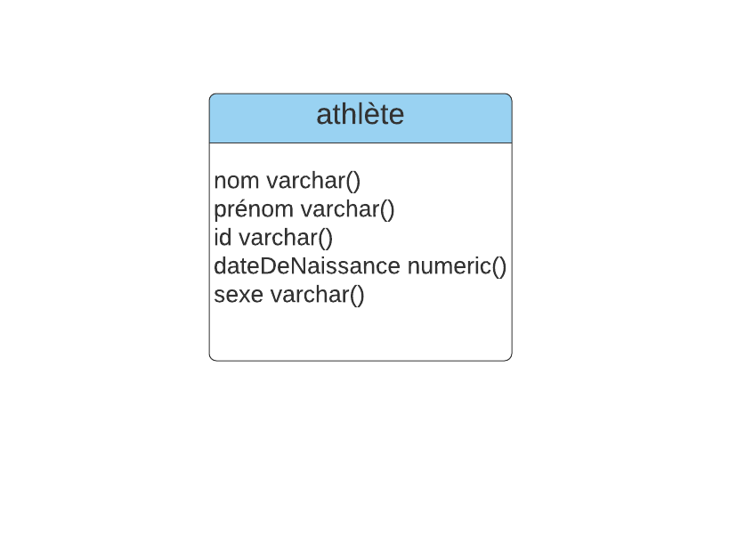
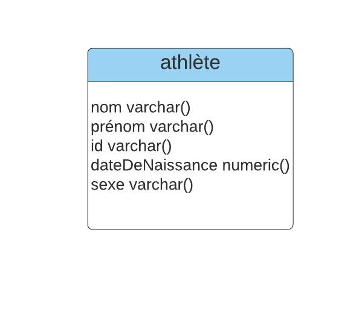
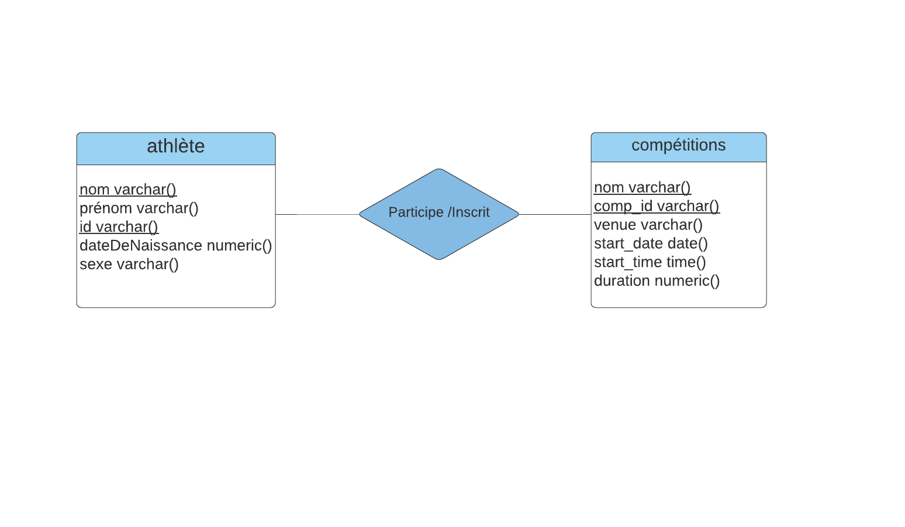
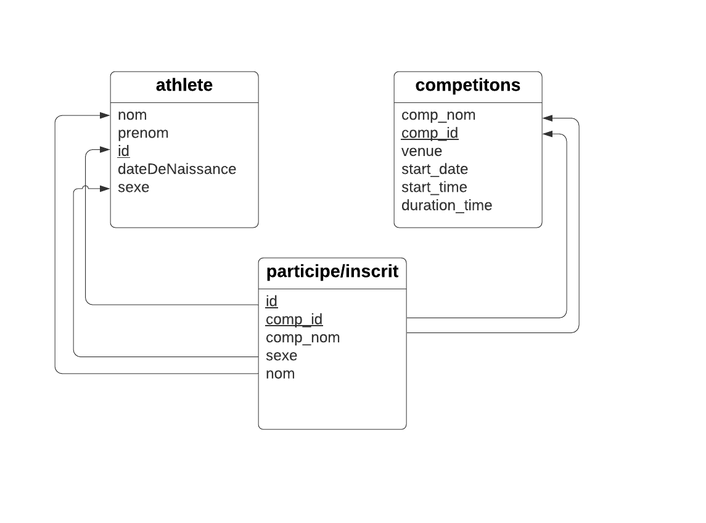

# Leader board


## Livrable 1 (5%) Hello-World

| Note | Description | Commentaire |
| --- | --- | --- |
| Configuration du repo GitHub | [GitHub Repo](https://github.com/MarakiAbiy/Livrable1Maraki) |
2.5 | Modèle ER | Voir ci-dessous |
| 2.5 | Modèle relationnel / schéma SQL | Les images et SQL ci-dessous |
| 1.0 | Exemples SQL pour insérer, mettre à jour, sélectionner et supprimer des données | Voir les exemples ci-dessous|
| 1.0 | README.md contient toutes les informations requises | Voir _cette_ page |
| 1.0 | Utilisation de git (messages de commit, tous les étudiants impliqués) | [Voir les commits dans GitHub](https://github.com/MarakiAbiy/Livrable1Maraki/commits/master) |
| / 10 | |

## Description de l'application

Cette base de données modélise un athlète, avec son nom, sa date de naissance et son sexe.

## Modèle Entité-Relationel

J'ai créer le Modèle ER avec [Lucidchart](/lucidCharts.md).



## Modèle relationnel

J'ai aussi créer le Modèle Relationnel avec [Lucidchart](//lucidCharts.md).



## Schéma SQL

Le schéma SQL est créer [Online SQL Interpreter](https://www.db-book.com/db7/university-lab-dir/sqljs.html).

```sql
CREATE TABLE athlete (
  nom varchar(),
  prenom varchar(),
  id varchar(),
  dateDeNaissance numeric(),
  sexe varchar(),

  PRIMARY KEY (id)
);
```

## Exemples de requêtes SQL

 Les requêtes pourrais être testés sur [Interpréteur SQL en ligne](https://www.db-book.com/db7/university-lab-dir/sqljs.html)

```sql

INSERT INTO athlete (nom, prenom, id, dateDeNaissance, sexe)
VALUES
('Smith', 'John', 1, '1993-01-15', 'm'),
('White', 'Snow', 2, '1980-08-03', 'f'),
('Jackson', 'Charles', 3, '1998-04-04', 'm'),
('Moore', 'Alexandra', 4, '1989-06-08', 'f');

```

Sélectionnons tous les athlètes «F».

```sql
SELECT *
FROM athlete
WHERE sexe = 'F';
```

Changeons tous les athlètes «m» à «M».

```sql
UPDATE athlete
SET sexe = 'M'
WHERE sexe = 'm';
```

Sélectionnons tous les athlètes «M».

```sql
SELECT *
FROM athlete
WHERE sexe = 'M';
```

Supprimons tous les athlètes.

```sql
DELETE FROM athlete;
```

La base de données est vide.

```sql
SELECT count(*)
FROM athlete;
```

## Livrable 2 (%5) Application et Base de Données

| Note | Description | Commentaire |
| --- | --- | --- |
| Configuration du repo GitHub | [GitHub Repo](https://github.com/MarakiAbiy/Livrable1Maraki) |
| 3.0 | Modèle ER | Voir ci-dessous |
| 3.0 | Modèle relationnel / schéma SQL | Les images et SQL ci-dessous |
| 1.0 | Application (READ-ONLY) | --- |
| 1.0 | SQL "seed"/ exemples pour les informations requises | --- |
| 1.0 | Utilisation de git (messages de commit, tous les étudiants impliqués) | [Voir les commits dans GitHub](https://github.com/MarakiAbiy/Livrable1Maraki/commits/master) |
| / 10 | --- |

## Modèle Entité-Relationel

J'ai créer le nouveau Modèle ER avec [Lucidchart](/lucidCharts.md) pour representer les modifications.



## Modèle relationnel

J'ai aussi créer le  nouveau Modèle Relationnel avec [Lucidchart](/lucidCharts.md) pour representer les modifications..


